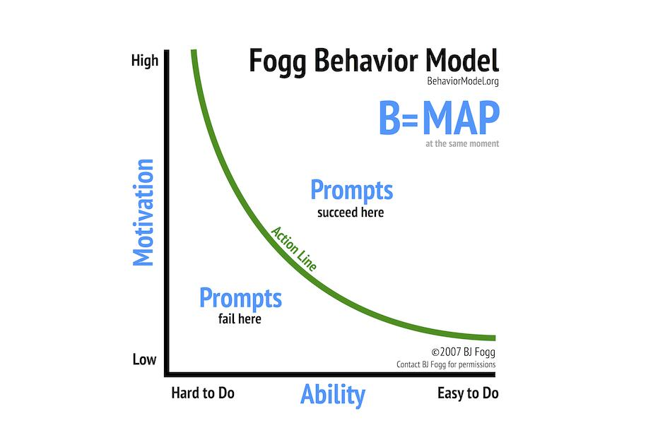

= September 2020 reading list
:toc:

== Science

=== Brains

https://www.fastcompany.com/90520750/duke-university-researchers-say-every-brain-activity-study-youve-ever-read-is-wrong?fbclid=IwAR2OnfqKodWPgl36c2v-ydamTH8nGN1EICgkJfP1GFd8Ds_GhrxoMeiP3tA

- FMRI (Functional MRI) machines are optimized for finding which parts
of the brain are involved in a given task.
- But FMRIs only measure blood flow to regions of the brain,
and not actual brain activity (which is presumably electric?)
- Blood flow levels also vary from scan to scan, not dependent on 'brain activity':
+
[quote]
____
Blood flow levels, apparently, change. “The correlation between one scan and a second is not even fair, it’s poor,” says lead author Ahmad Hariri, a professor of neuroscience and psychology at Duke University.
____

=== Fogg behavior model

https://engineering.shopify.com/blogs/engineering/shopify-monolith

Fogg behavior model states 3 factors for triggering behavior:

- Ability
- Motivation
- Prompt

____
[…] prompts are necessary for a desired behavior to happen,
but they're ineffective unless there's enough
motivation and ability.
____

== Information Architecture

=== Shopify's monolith

https://engineering.shopify.com/blogs/engineering/shopify-monolith

- Good breakdown of how they think their architecture
