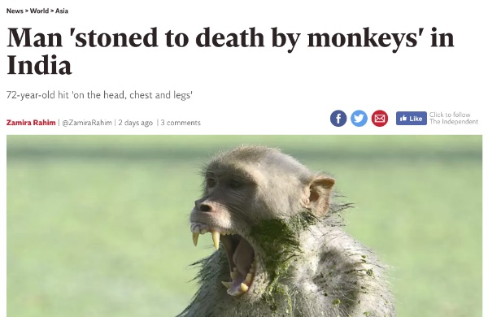

# The MIT "Moral Machine" and Other Ethical Mistakes - draft

<!-- TOC depthFrom:2 depthTo:6 withLinks:1 updateOnSave:1 orderedList:0 -->

- [First: What's wrong with the headline](#first-whats-wrong-with-the-headline)
- [Second: What's wrong with the survey](#second-whats-wrong-with-the-survey)
- [Is the driverless car an ethical subject?](#is-the-driverless-car-an-ethical-subject)
- [Issue of ownership](#issue-of-ownership)
- [Moving forward](#moving-forward)

<!-- /TOC -->

The VICE headline reads:

> Driverless Cars Should Spare Young People Over Old in Unavoidable Accidents, Massive Survey Finds

https://motherboard.vice.com/en_us/article/evw3w7/driverless-cars-spare-young-people-over-old-in-a-car-accident-moral-machine-survey-finds

[pdf](/jan2019-assets/vice-autonomous.pdf)

## First: What's wrong with the headline

- No. The conclusion that can be drawn from the survey is that when presented
  with two equally bad outcomes, people tend to think that killing young people
  is less preferable than killing old people.
- It is a statement about *human
  preferences*, and says nothing about what the driverless cars "should do".
- (This is a common attribution error in most ethical discussions re: machines.)
- In addition, it misunderstands what ethical problems are premised on in the
  first place: that the given situation is intractable and has no clear win
  state i.e. whichever horn of the dilemma you pick, you're picking an
  undesirable outcome[^1]. **Simply: ethical dilemmas are lose-lose situations. There is no "better" choice.**

[^1]: It's important to note that for a true ethical problem, there must be
no clear-cut solution i.e. if one of the choices in an ethical problem is
clearly better than the others, then it is not a true dilemma because there is
an obvious win state.

## Second: What's wrong with the survey

* When presented with a question of ethics, we must ask two very important questions:
	1. What are the options available?
	2. Who gets to make the choice?
* The "Moral Machine" experiment appears to have skipped question 2.
* I say this because Question 2 asks, given the situation, **"who is given moral agency?"**
	* This is an important question because it forces us to consider **who** we are asking to make an ethical choice.
	* Ethical agents have thrust upon them the responsibility of making a choice between the horns of an ethical dilemma[^1].
	* Any ethical discussion that follows **assumes** that the ethical agent _has the obligation to act ethically_, and _is bound by the same ethical framework as the rest of human society_.
	* This becomes a problem here because we have **under-considered** what it means to have a non-human actor placed in a very-human ethical situation.

**Case in point**:

[Man 'stoned to death by monkeys' in India](https://www.independent.co.uk/news/world/asia/man-stoned-death-monkeys-india-uttar-pradesh-tikri-doghat-police-a8595961.html). In a separate case in April 2018(mentioned in the same article), a baby was
snatched by a monkey and left dead in a well. The local police's reluctance to
pursue the case (Quote: "How can we register the case against monkeys?" said
Chitwan Singh, station officer at Doghat police headquarters. "This will make us
a laughing stock.") highlights a few things:

* They are reluctant to consider animals as within the locus of human society, and therefore are not bound to the rules of human behaviour and therefore not bound to the same legal frameworks.
* That is not to say that the monkeys will and should not be punished. It is to point out that to legally prosecute the monkeys would "make us [sic] a laughing stock", as it would afford them the same privileges as a human actor, and confer them assumptions of equivalence with a human actor.
* This non-consideration goes both ways: these monkeys see it fit to kill a man, and the other monkeys a baby. Conversely, animal life is not afforded the same privileges of human life in almost all human frameworks.

The question that has been omitted, then, in "Moral Machines" is: "**Is the driverless car an ethical subject?**"

## Is the driverless car an ethical subject?

* An ethical subject is one that, simply, is afforded consideration under an ethical framework, and therefore afforded the privilege of being owed ethical treatment (whatever that would mean).
* A simple litmus test for whether or not a thing is an ethical subject or not is to ask if "Thou shalt not kill" would apply to it.
* In the case of my burger, the answer is no: a cow is not (in my immediate society) an ethical subject.
* A more complex definition of an ethical subject would include the following considerations (loosely defined and non-exhaustive):
	* Is the subject conscious?
	* Is the subject capable of showing suffering?
	* Is the subject able to express choice?
* Given these considerations, it is possible to extend the locus of "ethical subject" to non-human entities, such as doggos and kittens.

Given these assumptions, a driverless car falls flatly outside the definition of an ethical subject. Why then is the "Moral Machine" framed as a question from the point of view of the car? **This is the problem.**

When we are considering an ethical dilemma, it is very important to make clear where the stakes are and who the stakeholders are. By framing the "Moral Machine" from the perspective of the car ("who should I kill?"), we have completely missed the point of the problem and instead have done a massive survey on how people would respond when presented with the age-old trolley problem.

**It is wrong to consider this issue from the point of view of the car because**:

1. You assume that the car has a human moral compass.
2. You assume that the car can suffer.
3. You assume that the car can make a choice.
4. You assume that the car is congnizant of these choices i.e. aware of the consequences of those choices, and the implications of it.
5. You assume that the car can be punished.

The conceit of the experiment can be extended to say that while the car itself can do none of these things (or at least, none of these things except 3), their makers can. But the nature of the industrial complex is such that this ethical decision, when it comes into play, will be infinitely distanced from the makers of the car that it cannot be considered the same class of ethical problems as a man deciding which train track the trolley should head down. Let's put it this way: if a driverless car ran over a kitten instead of a monkey, who do you prosecute? The distance of the car's makers from the incident makes it difficult to put forward an ethical or moral basis of wrongdoing unless there is a precedent for it, or it has been codified in law (which it has not, to my knowledge).

## Issue of ownership

It is not correct to assume that the car can be considered a
proxy for its makers.
- I.e. it is not correct to assume that whatever the car does can be
assumed to be the responsibility of its makers.
- This is the case for the following reasons:
	- First, we need to consider who or what owns the car.
	- Let's take current (non-autonomous cars) as an analog to explain issues re: machines and ownership.
	- Situation One: Let's say that a batch of cars from fictitious car makers X have faulty brakes.
		- One car's faulty brakes causes that car to run over the man that owns that car, killing him. In this case, the family of the dead man can sue maker X for negligence, but they cannot bring manslaughter or murder charges to maker X, because (1) the car is not susceptible to punishment, and (2) the car is not a proxy for its makers.
	- Situation Two: Let's say a car from that same batch is being driven on the road by person Y.
		- The brakes fail, and person Y runs over a pedestrian by accident.
		- In this case, (1) person Y is liable to be charged for causing grevious harm, or more severely, manslaughter; (2) maker X can be at maximum sued for negligence, but will not be in any way held legally responsible for the death of the pedestrian.
	- Given how these situations play out today, why should we expect any different when autonomous vehicles come into play?

## Moving forward

Moving forward, we should be very careful of the assumptions we make when discussing machines and ethics. Failing to consider the questions of agency (ability to make a choice) and understanding the burden of agency (being congnizant of the consequences of those choices) in deciding who or what gets to make an ethical decision, misframes important problems and leads us to wrong conclusions about how we should shape our relationships with these new machines.
