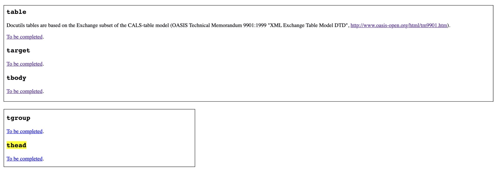

= August 2020 reading list
:toc:

== Writing things

=== James Baldwin's writing advice

Emily Temple,
'“Write a Sentence as Clean as a Bone” And Other Advice from James Baldwin',
published 2 Aug 2018 on
link:lithub.com[Lit Hub].
Available: https://lithub.com/write-a-sentence-as-clean-as-a-bone-and-other-advice-from-james-baldwin

The ones i liked:

[source]
----
Write to find out.

When you’re writing, you’re trying to find out something which you
don’t know. The whole language of writing for me is finding out what
you don’t want to know, what you don’t want to find out.
But something forces you to anyway.

-in a 1984 interview with The Paris Review
---------
Use every experience.

One writes out of one thing only—one’s own experience.
Everything depends on how relentlessly one forces from this
experience the last drop, sweet or bitter, it can possibly give.
This is the only real concern of the artist, to recreate out of the
disorder of life that order which is art.

-from “Autobiographical Notes,”
in the Collected Essays from Library of America
----------
Writing is hard.

Every form is difficult, no one is easier than another.
They all kick your ass. None of it comes easy.

-in a 1984 interview with The Paris Review
----------
Write towards truth.

I certainly can’t imagine art for art’s sake . . .
that’s a European approach, which never made any sense to me.
I think what you have to do, which is the difficult
thing about a writer, is avoid slogans.
You have to have the [guts] to protest the slogan,
no matter how noble it may sound.
It always hides something else;
the writer should try to expose what it hides.

-from a 1979 interview published in The New York Times
----------
----

on empty irony:

[source]
----
Don’t be too ironic.

You are speaking to an old rat.
I find much of so‐called avant‐garde writing utterly trivial.
If there is no moral question, there is no reason to write.
I’m an old‐fashioned writer and, despite the odds,
I want to change the world. What I hope to convey?
Well, joy, love, the passion to feel
how our choices affect the world . . . that’s all.

-from a 1979 interview published in The New York Times
----

two good reminders:

[source]
----
Write what you see.

I don’t try to be prophetic, as I don’t sit down to write literature.
It is simply this: a writer has to take all the risks of putting down
what he sees. No one can tell him about that.
No one can control that reality. It reminds me of something Pablo
Picasso was supposed to have said to Gertrude Stein while he was
painting her portrait. Gertrude said, “I don’t look like that.”
And Picasso replied, “You will.” And he was right.
-in a 1984 interview with The Paris Review
----------
Just keep writing.

Write. Find a way to keep alive and write.
There is nothing else to say. If you are going to be a writer there
is nothing I can say to stop you; if you’re not going to be a writer
nothing I can say will help you. What you really need at the
beginning is somebody to let you know that the effort is real.

-in a 1984 interview with The Paris Review
----

and the best one:

[source]
----
Simplicity is king.

You want to write a sentence as clean as a bone.
That is the goal.

-in a 1984 interview with The Paris Review
----

== Tech things

=== `mvim`

Finally figured out that `mvim` wasn't working
with my `git commit --amend` and `rebase -i` commands
because (but `git commit -m` works fine) because
those tell mvim for some reason to fork its process
which git interprets as the commit_edit file closing,
and is therefore an empty commit.

To fix, have to set editor to use `mvim --nofork`/`mvim -f`
instead of just `mvim`:

[source, bash]
----
export EDITOR='mvim --nofork'
----

=== Relative imports in python

As per
link:https://www.python.org/dev/peps/pep-0008/#imports[PEP 8],
instead of:

[source, python]
----
import ./foo
----

write relative imports as:

[source, python]
----
from . import foo
----

=== GREP with filenames

(ported from July 2020 reading list)

[source, shell]
----
grep -1 search\-term *.txt # list files with matches
grep -L search\-term *.txt # list files without matches
----

=== sips to manipulate images in the macos terminal

macOS has the nifty command `sips`
(scriptable image processing system)
that allows you to manipulate images
through the command line.

The following script loops through all the `jpg`
files in the current directory and

. Resizes them, making them 400px wide.
. (idk what `--optimizeColorForSharing` does)
. Sets the output dir to the current dir, so it
overwrites the files being processed (remember
to back up your originals first)

[source, shell]
----
for f in $(pwd)/*.jpg; do
    sips --resampleWidth 400 --optimizeColorForSharing -o . $f;
done
----

=== Implement `stub-columns` for sphinx-contrib/confluencebuilder

After several months of working with tables
that didn't allow me to set a 'header' column
in sphinx+confluence, I finally got around to
link:https://github.com/zeddee/confluencebuilder/pull/2[implementing it myself].

It's hacky, and probably not 'correct' i.e. i'm not
extending docutils correctly, but it works
and the tests pass so yeah.

So, on to documenting what my brain
tried to do while trying to get this to work:

* Had to track down where on earth we were
emitting table elements. I started off by
trawling through the code to figure out
where we were emitting HTML tags or modifying/extending
docutils. This actually took me a few weeks of intermittent
effort -- because everything was kept in storage.py.
* I was also trying to read 
link:https://docutils.sourceforge.io/docs/ref/doctree.html[docutils documentation on how it crunches rST],
and … it turns out that tables are not documented:
+

* To be fair, the docutils docs also point us to the
link:https://www.oasis-open.org/specs/tm9901.htm[OASIS spec] for tables, which … I have not read because I was lazy (😅)
and thought it would be much faster to track down examples
of how headings in tables are handled. But the spec
does look useful.
* Also looked at the
link:https://www.sphinx-doc.org/en/master/extdev/index.html[Sphinx ext dev docs],
but couldn't find anything specifically useful for
implementing stub-columns.
* After a bit more digging into docutils and confluencebuilder
source code, it turns out that what I want to modify
is the html `writer`. I also figured that what I specifically
wanted to find was how `th` tags are currently added
to the header rows (since `header-rows` works, even if
the confluencebuilder docs say that
link: https://github.com/sphinx-contrib/confluencebuilder/blob/master/doc/markup.rst[they aren't supported])
** tracked down implementation of tables in docutils
to here: https://svn.code.sf.net/p/docutils/code/trunk/docutils/docutils/writers/_html_base.py
** tracked down general writer code in confluencebuilder
to here: https://github.com/sphinx-contrib/confluencebuilder/blob/master/sphinxcontrib/confluencebuilder/translator/storage.py
*** which was a bit weird for me because
docutils places `visit_*` methods under `writers`
but confluencebuilder places them under `translator` --
which was confusing because i somehow associated
`translator` with docutils'
link:http://svn.code.sf.net/p/docutils/code/trunk/docutils/docutils/transforms/[`transforms`]
*** But tl;dr i found it.
** So I decided to take the plunge and edit `translator/storage.py`
directly.
*** my gut was telling me that i would need
the `visit_colspec` method, but
i didn't really want to implement `colspec`
as it's not (?) part of the HTML/5 spec
*** But turns out that as docutils traverses
(the traversal method is quite interesting as
well, but i forgot where it's put) the doctree,
it _must_ call `visit_colspec` as it traverses
a table. I haven't grasped this yet -- i don't know
what nodes are traversed where.
*** implemented feature flag, because i don't
know where this works and where this doesn't;
only tested on confluence 7.6.2 locally run
with 
link:https://github.com/teamatldocker/confluence[teamatldocker/confluence] docker image.
+
.Run with:
[source, bash]
----
docker run -d -p 80:8090 --name confluence teamatldocker/confluence
----
** first thing I tried was to modify `visit_entry`
to try and figure out if i'm targeting
table cells correctly. Thought this would be
the right thing to do because this is also where
we set `target_tag = 'th'/'td'`.
Did this by running a
few conditionals:
+
[source,python]
----
def visit_entry(self,node):
    if self._thead_context[-1]:
        target_tag = 'th'
    elif self._stub_columns_experimental and \
            CONDITION_HERE:
        print(CONDITION_HERE)
    else:
        target_tag = 'td'

"""
CONDITION_HERE:

these failed; i found instances
in the docutils code where we're
adding these as attributes,
so I thought I'd just try to add
these and run the code.
- 'stub' in node
- 'stub_column' in node

what eventually worked was:
- node.parent.parent.parent.stubs[node.parent.column]

took it from docutils/writers/_base_html.py,
which was super convoluted but worked
"""
----

** Once I did that, I just had to follow
the error messages I got when I ran the code
to figure out where I had to port more
code:
+
[source]
----
Exception occurred:
  File "/Users/zeddee/working/eiq/confluencebuilder/sphinxcontrib/confluencebuilder/translator/storage.py", line 752, in visit_entry
    elif node.parent.parent.parent.stubs[node.parent.column]:
AttributeError: 'tgroup' object has no attribute 'stubs'
The full traceback has been saved in /var/folders/5q/k4tg4dlj0dnfyh6tcn0cwk0c0000gn/T/sphinx-err-r3y9g_uy.log, if you want to report the issue to the developers.
----

=== Jupyter Notebook tips

==== Run notebook in terminal without launching jupyter server

[source, bash]
----
# https://stackoverflow.com/a/40311709
$ jupyter nbconvert --to notebook --inplace --execute mynotebook.ipynb
----

I wrote a bash alias for this:

[source, bash]
----
runnotebook() {
  if ! command -v jupyter; then
    echo Requires jupyter. Install with pip.
  fi

  if [[ -f $1 ]]; then
    jupyter nbconvert --to notebook --inplace --execute $1
  else
    echo First argument must be file
  fi
}
----

==== Change size of plots

[source, python]
----
plt.rcParams["figure.figsize"]= (20,15)
----

==== Change font size in plots

apparently most plotting functions
accept a `fontsize:int` parameter
as an argument:

[source,python]
----
_FONTSIZE=20
#...
plt.xticks(rotation="vertical", fontsize=_FONTSIZE)
plt.xlabel("Day of week", fontsize=_FONTSIZE)
plt.yticks(np.arange(0, df["Daily_delta"].max(), step=5), fontsize=_FONTSIZE)
plt.ylabel("Daily change", fontsize=_FONTSIZE)
plt.legend(fontsize=_FONTSIZE)
----

=== GitHub actions docs

https://docs.github.com/en/actions/reference/software-installed-on-github-hosted-runners

doesn't look too hard… 😅

most interesting is that there is a macOS 10.15
VM available for use!

== Data resources

Small dump of data science-related resources that have
accumulated across the 4 browsers (not browser windows)
I have open.

=== Data science

* Associate Press's Datakit tool, derived from cookie cutter: https://datakit.ap.org/
* John Peng, "Tukey, Design Thinking, and Better Questions", published 17 Apr 2019.
Available: https://simplystatistics.org/2019/04/17/tukey-design-thinking-and-better-questions/
** N.B.: The writer cites John Tukey:
+
____
Far better an approximate answer to the right question,
which is often vague, than an exact answer to the wrong question,
which can always be made precise.
____
+
Which is horrifying to me in many different ways.
** Author reads it as a call for better questions.
Maybe. But taken at face value, I think
that's giving the quote a bit of a wide berth.
Maybe reading the actual
link:https://projecteuclid.org/euclid.aoms/1177704711[paper]
he's quoting from would lend to that interpretation.

=== Journalism & Security

* Digital security primer by GIJN (Global Investigative Journalism Network): https://gijn.org/digital-security/
* Grégoire Pouget, "Digital Security for Journalists Requires an Adaptable Toolkit",
published 16 July 2019 on GIJN. Available:
https://gijn.org/2019/07/16/digital-security-for-journalists-requires-an-adaptable-toolkit/
* "The Field Guide to Security Training in the Newsroom" by 
link:https://github.com/OpenNewsLabs/[OpenNewsLabs].
** https://securitytraining.opennews.org/en/latest/?mc_cid=62ce19ed91&mc_eid=03ff8f9b25
** Also on GitHub: https://github.com/OpenNewsLabs/field-guide-security-training-newsroom
* "Measures for Newsrooms and Journalists to Address Online Harassment"
by IPI (International Press Institute)'s Ontheline project:
https://newsrooms-ontheline.ipi.media/?mc_cid=743bbd83e2&mc_eid=d358ec5545
* "Watching Them Watching You: Opsec for Security Investigators",
published 17 Dec 2019 by Cosive.
Avail: https://www.cosive.com/blog/2019/12/3/watching-them-watching-you-opsec-for-security-investigators

=== Law & Ethics

* Duke Law and Technology Review: https://dltr.law.duke.edu/
** A feed of papers (including PDF links) from Duke Law.
** Of (current) particular interest:
Walz & Firth-Butterfield,
"Implementing Ethics Into Artificial Intelligence: A Contribution,
from a Legal Perspective, to the Development of an AI Governance Regime"
18 Duke L. & Tech. Rev. 176.
Avail: https://scholarship.law.duke.edu/cgi/viewcontent.cgi?article=1352&context=dltr
* The Turing Way (for ethical, reproducible, collaborative data science):
https://the-turing-way.netlify.app/welcome
